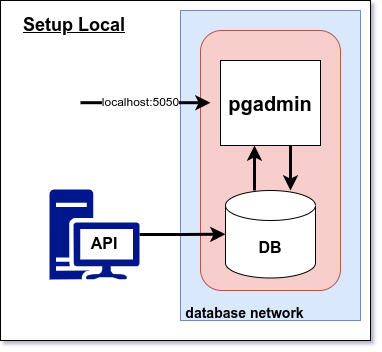

# Setup Localhost


## Requirements

- [Docker](https://docs.docker.com/get-docker/) Docker installed

## Features

- [PostgreSQL](https://www.postgresql.org/) for database
- [pgAdmin](https://www.pgadmin.org/) for database management
- [Docker](https://www.docker.com/) for containerization
- [Docker Compose](https://docs.docker.com/compose/) for container orchestration

## Debugging

- Check if all containers are running with `docker ps -a`
- Check if all env variables are set in .env file and are correct
- Check if docker compose has read all environment variables with `docker-compose config`
- Check the logs of the individual container with `docker logs <container_name>` or `docker logs --follow <container_name>`

## Setup

### 1. Complete the docker-compose.yml file

```bash
    pgadmin:
    image: dpage/pgadmin4:7.3
    
    .....
    
    environment:
      PGADMIN_DEFAULT_EMAIL: <your_email>
      PGADMIN_DEFAULT_PASSWORD: <your_password>
```

### 2. Run Docker

```bash
  docker compose up -d
```

### 3. Access Postgres pgadmin dashboard through browser

```bash
  localhost:5050
```
#### 3.1. Login
- login: **<your_email>** (see docker-compose.yml)
- password: **<your_password>** (see docker-compose.yml)

#### 3.2. Add new server
- Host name/address: **db**
- Port: **5432**
- password: **<your_password>** (see docker-compose.yml)

*** 

###  Stop Docker

```bash
  docker-compose down
```

### Reset DB data installation

(-v) // remove volumes
```bash
 docker-compose down -v 
```

```bash
 sudo  rm -rf ./data
```

***


